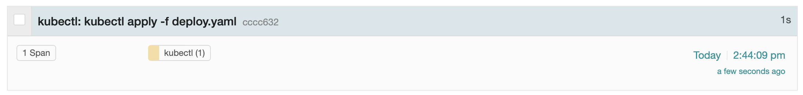

# Trace kubectl with OpenTelemetry



kubectl plugin to generate OpenTelemetry traces for kubectl commands.

```
kubectl otel <Your Existing Command>
```

For example:

```
kubectl otel apply -f deployment.yaml
```

This can be aliased to make it more automated:

```
alias ko='kubectl otel'
ko apply -f deployment.yaml
```

## Prerequisites
- Currently only supports Linux and MacOS
- You must have [a standalone binary of tracepusher in your path](https://github.com/agardnerIT/tracepusher/releases/latest) (ie. you are able to run `tracepusher` from the command line and see output)
- You must have an OpenTelemetry collector somewhere so the spans can be sent there

## Installation

krew listing - coming soon

For now:
- Download [kubectl-otel](kubectl-otel)
- Make it executable: `chmod +x kubectl-otel`
- Move it to anywhere in your path (eg. `/usr/local/bin`): `sudo mv kubectl-otel /usr/local/bin`
- Try it out: `kubectl otel version` should execute `kubectl version` and trace the time (expected to be quick eg. 0 seconds)

## Defaults and Configuration

The plugin assumes the following:

- The OTEL collector URL defaults to `http://localhost:4318`
- The span service name defaults to `kubectl`

Use environment variable: `KP_OTELCOL_ENDPOINT` to specify your collector endpoint

Use environment variable: `KP_SERVICE_NAME` to specify a different service name

```
export KP_OTEL_ENDPOINT=http://otelcol.somewhere.com:4318
export KP_OTEL_ENDPOINT=kubectl-dev
kubectl otel apply -f deployment.yaml
```
